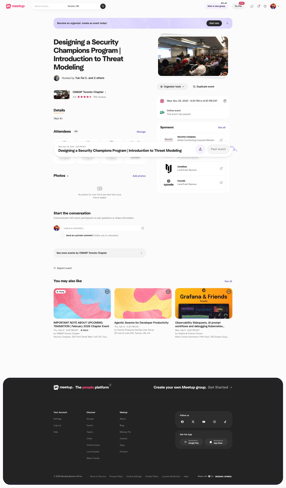
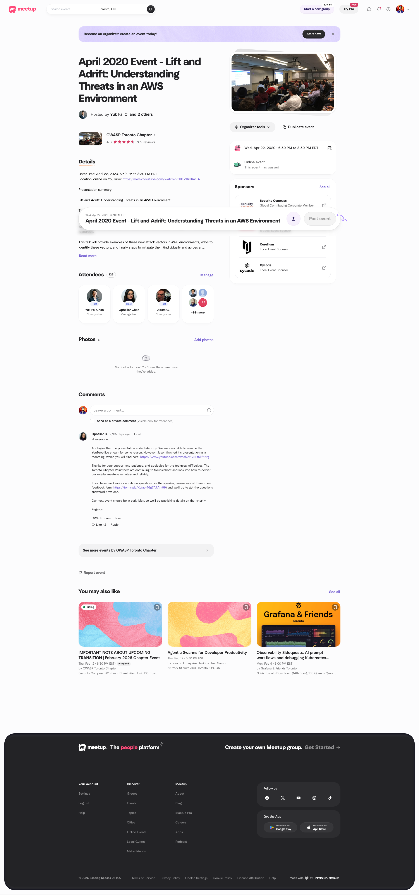
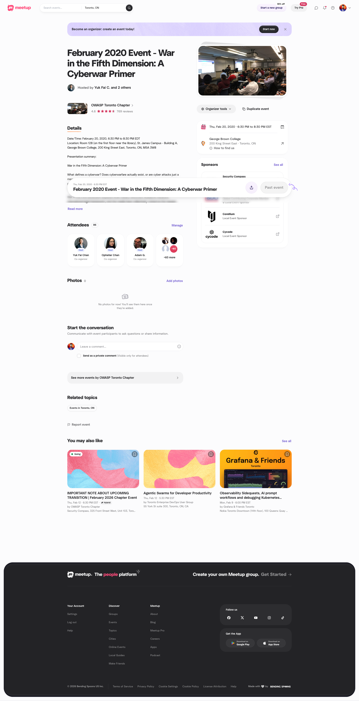
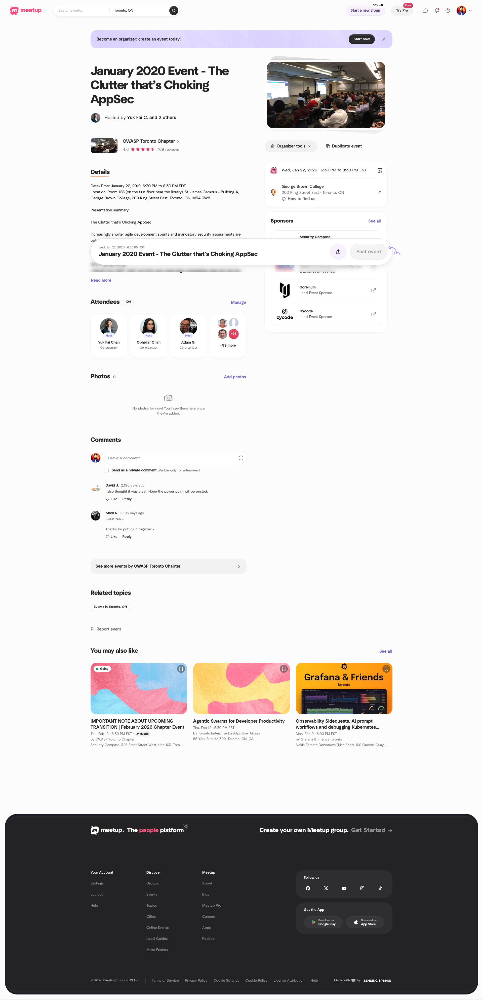

### 2020 ###

---

**Date/Time**: November 25, 2020, 06:30 PM
**Location**: See event details

**Designing a Security Champions Program | Introduction to Threat Modeling**

[View on Meetup](https://www.meetup.com/owasp-toronto/events/274520212)

---

**Date/Time**: October 28, 2020, 06:30 PM
**Location**: See event details

**Frida 101 - Testing Mobile Apps | High-level reverse engineering tactics**

[View on Meetup](https://www.meetup.com/owasp-toronto/events/273965978)

---

**Date/Time**: April 22, 2020, 06:30 PM
**Location**: See event details

**April 2020 Event - Lift and Adrift: Understanding Threats in an AWS Environment**

[View on Meetup](https://www.meetup.com/owasp-toronto/events/270012697)

---

**Date/Time**: February 20, 2020, 06:30 PM
**Location**: See event details

**February 2020 Event - War in the Fifth Dimension: A Cyberwar Primer**

[View on Meetup](https://www.meetup.com/owasp-toronto/events/268415559)

---

**Date/Time**: January 22, 2020, 06:30 PM
**Location**: See event details

**January 2020 Event - The Clutter that’s Choking AppSec**

[View on Meetup](https://www.meetup.com/owasp-toronto/events/267762345)

