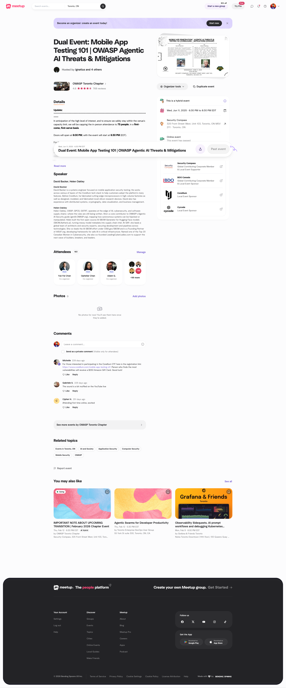
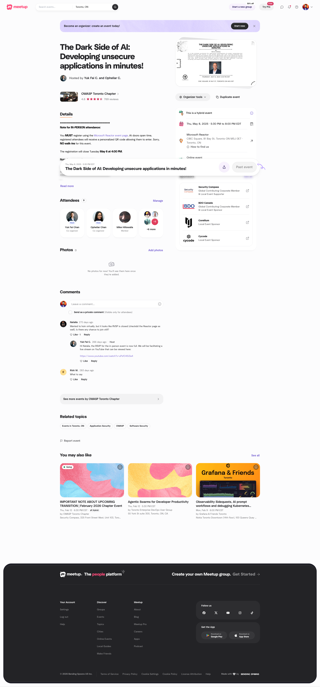
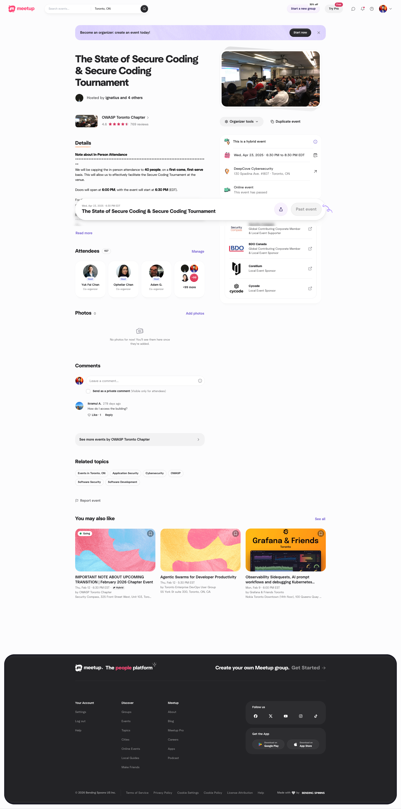

### 2025 ###

---

**Date/Time**: December 11, 2025, 10:00 AM
**Location**: See event details

**OWASP Toronto X CyberToronto InfoSec Conference**

[View on Meetup](https://www.meetup.com/owasp-toronto/events/312264836)

---

**Date/Time**: November 12, 2025, 06:30 PM
**Location**: See event details

**Clusterfuck -- A Multi-Stage Attack Simulation Framework for Kubernetes**

[View on Meetup](https://www.meetup.com/owasp-toronto/events/311661253)

---

**Date/Time**: October 15, 2025, 06:30 PM
**Location**: See event details

**Beyond Scans: eBPF-Powered Runtime Security for Applications and AI**

[View on Meetup](https://www.meetup.com/owasp-toronto/events/311177941)

---

**Date/Time**: September 17, 2025, 06:30 PM
**Location**: See event details

**Becoming a Caido Power User: From Recon to Root**

[View on Meetup](https://www.meetup.com/owasp-toronto/events/310758481)

---

**Date/Time**: August 21, 2025, 06:30 PM
**Location**: See event details

**Reducing Application Security Risk with ASPM: Future-Proofing for 2025 & Beyond**

[View on Meetup](https://www.meetup.com/owasp-toronto/events/310318996)

---

**Date/Time**: July 16, 2025, 06:30 PM
**Location**: See event details

**Secure Vibe Coding: 5 Key Lessons | The AI Appsec Nightmare**

[View on Meetup](https://www.meetup.com/owasp-toronto/events/308560869)

---

**Date/Time**: June 11, 2025, 06:30 PM
**Location**: See event details

**Dual Event: Mobile App Testing 101 | OWASP Agentic AI Threats & Mitigations**

[View on Meetup](https://www.meetup.com/owasp-toronto/events/307827138)

---

**Date/Time**: May 08, 2025, 05:30 PM
**Location**: See event details

**The Dark Side of AI: Developing unsecure applications in minutes!**

[View on Meetup](https://www.meetup.com/owasp-toronto/events/307305805)

---

**Date/Time**: April 23, 2025, 06:30 PM
**Location**: See event details

**The State of Secure Coding & Secure Coding Tournament**

[View on Meetup](https://www.meetup.com/owasp-toronto/events/306889573)

---

**Date/Time**: March 19, 2025, 06:30 PM
**Location**: See event details

**How to Utilize AI in Offensive Security—An Intro to Offensive AI Tooling**

[View on Meetup](https://www.meetup.com/owasp-toronto/events/305752677)

---

**Date/Time**: January 22, 2025, 06:30 PM
**Location**: See event details

**Modern AppSec Requires a Modern Approach**

[View on Meetup](https://www.meetup.com/owasp-toronto/events/305601912)

