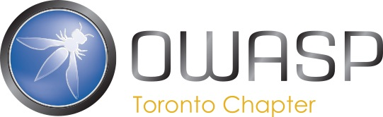

---

layout: col-sidebar
title: OWASP Toronto
tags: canada
level: 4
region: North America
---

Welcome to the Toronto chapter homepage.

Upcoming Sessions
-----------------

**Date/Time**: April 22, 2020, 6:30 PM to 8:30 PM EDT

**Location**: Virtually on YouTube: https://www.youtube.com/watch?v=RlKZXiHKaG4

**Presentation summary:**

**Lift and Adrift: Understanding Threats in an AWS Environment**

The security landscape continues to change as more workloads migrate to cloud services such as AWS. At this point, attacks targeting on-premise environments are generally well understood and mitigated. However, the complexity of cloud services and the ease with which they can be used lead to an array of new attack vectors arising from misconfigured resources.

This talk will provide examples of these new attack vectors in AWS environments, ways to identify these vectors, and finally steps to mitigate them (individually and across an organisation). It is intended to be an introductory talk, and does not require advanced knowledge of AWS services.

**Presenter bio:**

**Jason Plummer**

Jason Plummer is a Senior Security Consultant at Security Compass in Toronto, focusing on the offensive side of security. He spends most days at the intersection of application and cloud security. Prior to going on the offensive, Jason spent time on the defensive side with experience in the SOC and his national CSIRT.
